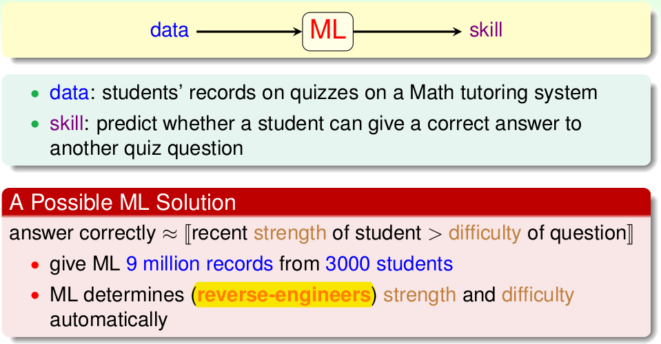
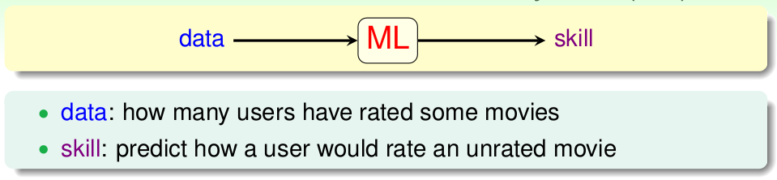
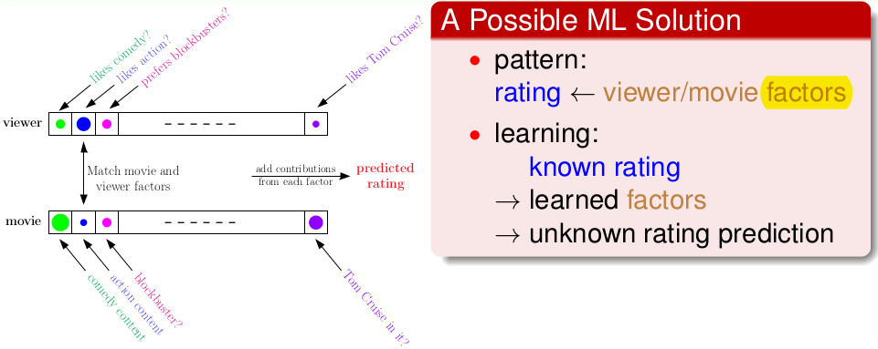
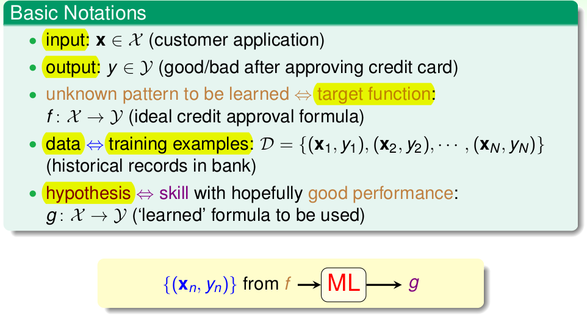
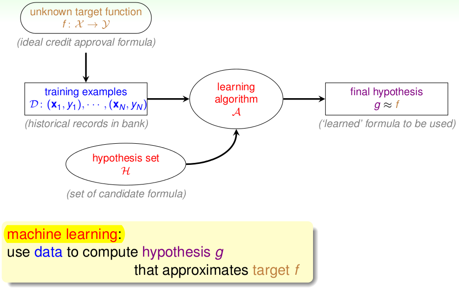
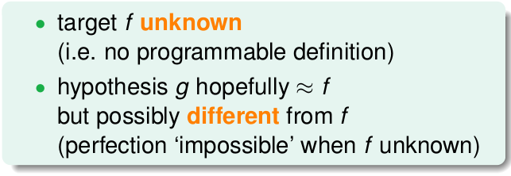
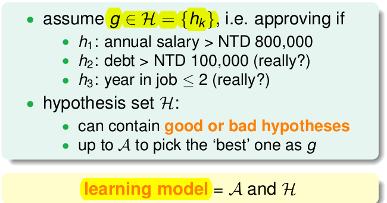
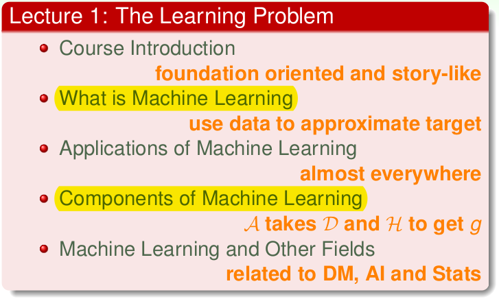

# Lecture 1: The Learning Problem

## **Foundation Oriented ML Course**

* Story-like:
  * **When** Can Machines Learn? \(illustrative + technical\)
  * **Why** Can Machines Learn? \(theoretical + illustrative\)
  * **How** Can Machines Learn? \(technical + practical\)
  * How Can Machines Learn **Better**? \(practical + theoretical\)

## From Learning to Machine Learning

## The Machine Learning Route

ML: an **alternative route** to build complicated systems

#### Some Use Scenarios

* when human cannot program the system manually

  -&gt; _navigating on Mars_

* when human cannot ‘define the solution’ easily

  -&gt; _speech/visual recognition_

* when needing rapid decisions that humans cannot do

  -&gt; _high-frequency trading_

* when needing to be user-oriented in a massive scale

  -&gt; _consumer-targeted marketing_

## Key Essence of Machine Learning

## ML Example

## Formalize the Learning Problem

## Practical Definition of Machine Learning

## Summary

