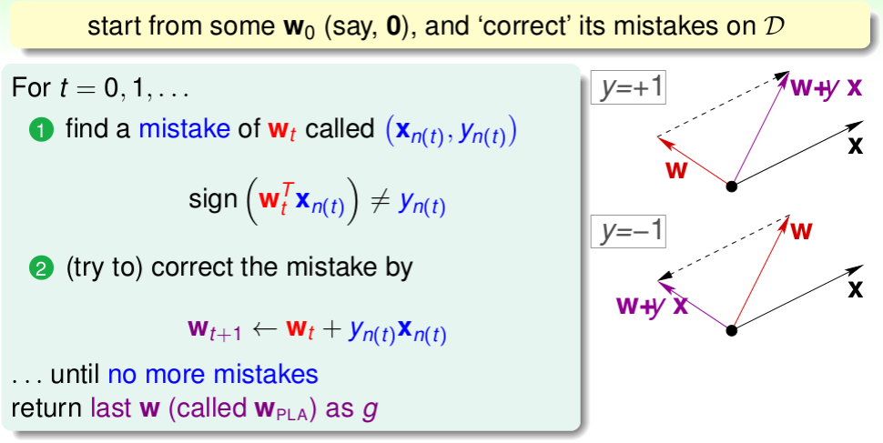
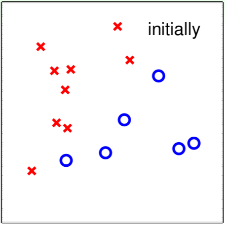
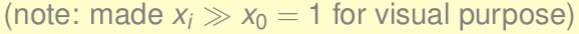
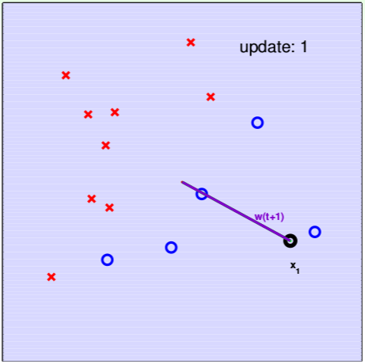
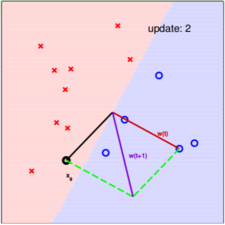
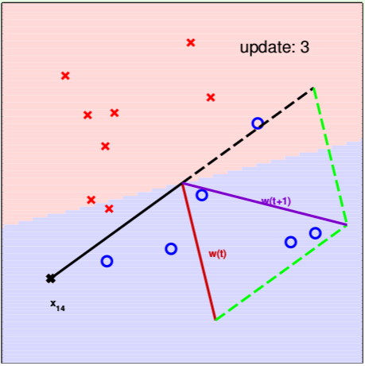
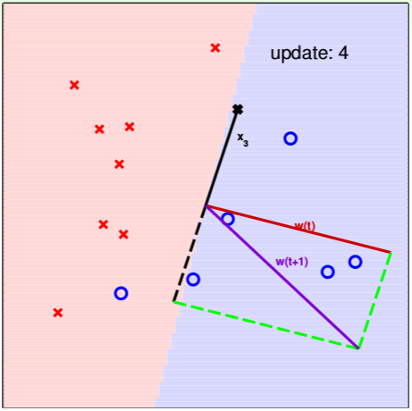

# Lecture 2: Learning to Answer Yes/No

## A Simple Hypothesis Set: the "Perceptron"

## Vector Form of Perceptron Hypothesis

## Perceptrons in 2D Plane

## Select Hypothesis from Hypothesis Set

## Perceptron Learning Algorithm \(PLA\)

## Seeing is Believing

